# Aishwarya Manoj Notebook

## January 20th, 2026

#### The objective of today's session was to discuss project ideas of our group. 

We know that we have to each post our own project ideas on the web board, but we wanted all our ideas to be projects we would truly be interested in doing as a group, since whichever idea that gets approved by the professor would be the 
project our group would end up doing. So, we each came up with our own project
ideas but also discussed aspects to consider when coming up with them. The main thing was we discussed that the project would have to have a major PCB component to meet class requirements, and also that the project's main functionality would have to not rely too much on mechanical functioning, because that would add huge time constraints and take the focus away from the electronics. For instance, an idea Estela came up with was having a scooter or some type of eletric vehicle, but again that would require too much mechanical complexity. We decided that embedded projects would be best for our team as me and Anjali both have experience working on embedded software and Estela has experience with PCB design. So, we each decided to come up with some ideas in that realm. I thought it would be good if I came up with something that integrates sensors with something I enjoy, like art, reading, or music.

## January 21st, 2026

#### The objective of today's session was to discuss the feasibility and complexity of PCB designs for our project.

Today Anjali, Estela, and I met up to discuss PCBs in detail and talk about what types of projects would be too difficult to complete. Estela has a lot of PCB design experience whereas my only experience so far has been the PCB training this course offers. We discussed how we could use a microcontroller to control various sensors and how it would probably be easiest and most feasible given the time constraints to create a project that relies heavily on sensor data. This is because sensors would allow us to use our embeddded programming skills for callibration and data capturing and also allow us to design a PCB based on the specific sensor parts we are using. Overall, this made sense to me and really helped with my ideation because beforehand, I wasn't sure what kinds of projects would be feasible for a PCB in this timeframe. I decided to start thinking about projects we could create that integrate sensors with PWM signals (since that is a specific area of embedded programming I have a lot of experience with.)

## January 22nd, 2026

#### The objective of today's session was to complete my initial web board post.

Today I worked on my initial web board post. I thought it would be interesting
to create a project that is basically a manual page flipper for a physical book.
It would be similar to a page flipper for a kindle on a stand, but it would hold
physical books. It would be useful for people with physical disabilities, or
anyone who wants to read comfortably before bed without blue light entering
their eyes and disrupting their sleep. The motion would be controlled with 
hand motions covering a laser or sensor streaming out from a clip on someone's
shirt collar. I think this is a good idea because it has sensors, embedded programming, would rely heavily on PCB design, and the implementation has uses that could really help people.

## January 27th, 2026

#### The objective of today's session was to get feedback on our initial project ideas and decide on the best idea to propose for RFA approval.

We went to office hours to talk about our project ideas and get feedback from TAs
about what would be the best project for our team (me, Anjali, and Estela) to pursue. The professor left a comment on my idea on the web board and said
it seemed more like a project searching for a problem, as in the usage isn't
really a thing that people need. So I felt, since the project idea wasn't
addressing a problem the professor sees, it was not the best idea to build off
of. The TA really liked Estela's aquaponics project idea, creating an automated desktop aquaponics system for plants and fish. We discussed a bit more and I think
we are going to submit that project idea for RFA Approval. I believe this is a strong project because it implements a lot of different sensors and Estela is confident that we could get the PCB done in time given that it primarily uses a bunch of sensors. We are also thinking of designing our own water pump for the aquaponics system as that would allow us to change the water circulation rate based on what is required at a given time (for instance, if the flow rate is low, we would be able to increase the speed of the water pump easily).

## January 29th, 2026

#### The objective of today's session was to further plan out our aquaponics idea as that project had the most positive feedback from professors and was most likely to get RFA approval.

Our team met up to continue discussing our Aquaponics project idea. The core idea is to create an Automated Desktop Aquaponics system that cycles water from a fish tank with fish, up to an incubator with plants (the plant roots will touch the water), and back down to the tank (as the water is now clean and filtered due to the roots absorbing nutrients from it). We decided to define subsystems that we would need to build. We figured out what a Beta fish would need to survive, as well as plants, and used that to really come up with the specific subsystems we want to build for our project. We initially had too many ideas, like building a 
water pump from scratch and also building the fish feeder, so we knew that we had to make some changes to ensure that we would be able to build a working simple version of this project for the timeline of this class. We ultimately decided on having a fish feeder subsystem with a simple servo motor used to rotate a fish feeder cylinder with an
opening. I'm thinking we can time this to feed the fish once every 24 hours. We also decided on a lighting subsystem for the plants, where we'll run a light cycle to promote plant growth. Then, I hunted for various sensors we could use for our water quality subsytem. I ended up finding water-safe temperature sensor, pH sensor, and water flow meter. We also decided on a power subsystem and a water pump subsystem. I found the water pump but we found that we will need to be able to adjust the speed of the water pump, so we continued to search for a pump with wiring so that we can actually control the circuit. I have attached images of the various sensors below. 

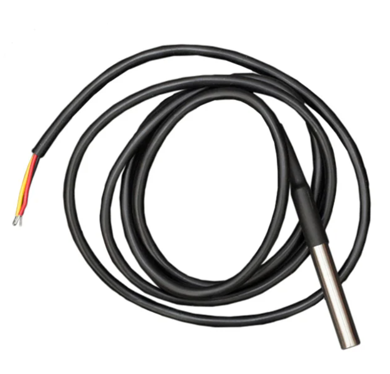

_**Figure 1: The water-safe temperature sensor we will use**_

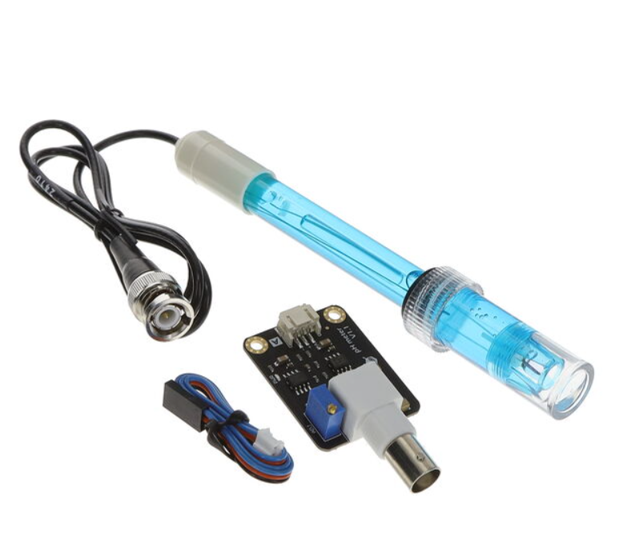

_**Figure 2: The pH sensor we will use**_

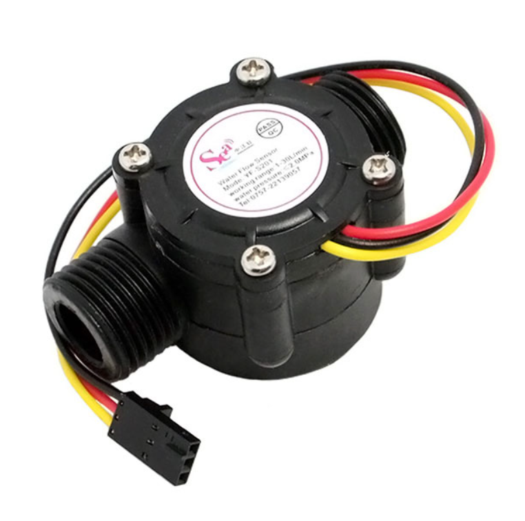

_**Figure 3: The flow meter we will use**_

Sources:

https://www.adafruit.com/product/381?gad_source=1&gad_campaignid=23438252138&gbraid=0AAAAADx9JvQ3qmjjw72X7CmfS2hvWiGjp&gclid=CjwKCAjwzevPBhBaEiwAplAxvuNWrCWSIEP4WYOgeB42JtMz2oa1mSHehpzxezJOfDCbLGHMIqBpqhoCM80QAvD_BwE

https://www.digikey.com/en/products/detail/dfrobot/SEN0161/6579368

https://www.digikey.com/en/products/detail/seeed-technology-co-ltd/314150005/5488047

## February 3rd, 2026

#### The objective of today's session was to create our project proposal since our Aquaponics idea was RFA approved.

We got together as a team to work on our project proposal since our Aquaponics project idea was approved. We discussed microcontroller options and whether we wanted to use an STM or ESP type of microcontroller. We compared the need for more pins with the STM or for having software connectivity for bluetooth. We decided to use ESP32 as it has bluetooth connectivity and we might want to create an app to go with our project in the future.

I worked on writing up the subsystem requirements and verification for the water subsystem, as well as writing up the ethics section. I also helped to edit and work on the fish feeder subsystem section and the water pump subsystem section. Overall, I read through a bunch of data sheets for the main parts of each of these systems to make sure that I could set appropriate requirements that matched with voltage readings and sensor readings of the sensors in the datasheet. 

To explain our project in more detail, we have five main subsystems: the power subsystem, the water quality subsystem, the water pump subsystem, the fish feeder subsystem, and the grow lights subsystem. The power subsystem powers all the sensors, the water pump, and the fish feeder. Because a lot of our sensors have different powering voltages (and so does our microcontroller) we will need an LDO and a buck converter to control the voltage that gets sent to different parts. We also decided to get a charger that connects to the wall for our project, rather than using batteries, as one of our goals is to be able to run our project for 24 hours without issues and the wall charger would avoid the issue of batteries running out of charge. The water pump subsystem is basically a water pump that will circulate water from the tank to the plants above the tank. The speed of the pump will be adjusted based on the flow rate measured. The water quality subsystem will measure the temperature, pH, and flow rate of the water and will have fault LEDs to indicate if any of those measurements are outside the ideal range. The fish feeder subsystem will be a simple, servo-motor based fish feeder that will rotate once every 24 hours to dump food into the tank for the fish. Thus, the whole system is automated for the lifecycle of the plants and the fish.

We also met with the machine shop to discuss what our physical project apparatus would be like and got their approval for our design.

## February 11th, 2026

#### The objective of today's meeting was to meet with our TA for the first time and get feedback on our project and its block diagram.

We created an initial block diagram for our project today. We planned out how all the sensors would connect with the fault LEDs and how control would flow in our project. The core idea is that all the sensors send data back to the microcontroller so that we can send out signals to light up or turn off the fault LEDs accordingly. The signal taken in from the flow sensor will also be used to send out a PWM signal to the water pump so that its speed can be adjusted as needed. I have attached an image of this initial block diagram below, as well as our model of what we want the project to look like.

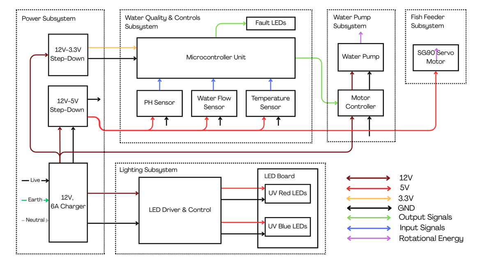

_**Figure 4: Our initial block diagram**_

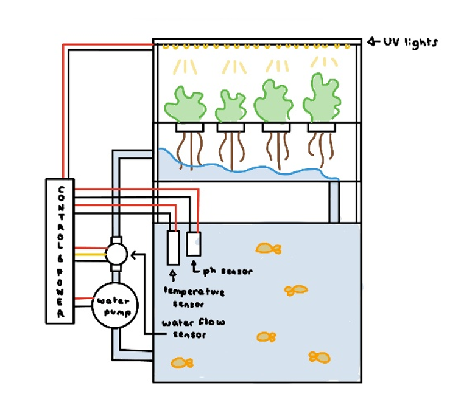

_**Figure 5: The initial design of our project idea**_

We had our first meeting with our TA after we worked on our block diagram, her name is Manvi Jha. We talked to her about our project plans and showed her our block diagram for our project, as well as how our proposal was coming along. She said everything looked good so we are continuing to finish up our proposal which we will submit before the deadline later this week. 

## February 16th, 2026

#### The objective of this session was to work on designing the first version of our PCB.

Today we worked on our PCB design (the first version of our PCB) so that we can show our TA before the extra credit deadline this Friday. I helped find various parts and connectors for our PCB, specifically a ton of connectors for the water quality sensors (PH, temperature, and water flow rate) as well as all of the resistors for our board. Estela calculated what was needed for the resistors in the PCB schematic  (what their ohmic values should be) so I found parts that will work according to the resistance value and sizing, as well as other parts such as fuses. The resistor footprint sizing was a bit challenging as there are so many options for surface mount resistors and I had never done this before this class. I decided to go with the estimates that resistors taking in around 5 Volts in the schematic could be of size 0805 SMD, that resistors taking in 3.3 Volts could be of size 0603 SMD, that those taking in 12 Volts could be 0805 SMD, and that those taking in 36 Volts or other similarly large resistors could be 0805-1206 SMD. These sizes were decided based on speaking with Estela about her past experience with PCB design and what sizes are typically used for what voltage ratings. I used this, along with the schematic, to pick out resistors.

## February 17th, 2026

#### The objective of this session was to work on assigning footprints to various parts of the PCB.

As we continued to work on the PCB, we decided to split up the work to let everyone grow their PCB skills and to decrease the amount of time this task will take. I have been assigning footprints for the resistors and various other components like switches and fuses. There were about 36 resistors in our schematic so it took a lot of time to find the right ones. I ended up learning a lot about how to import footprints from mouser and also find associated resistors from digikey, which is good because it allowed me to quickly and efficiently get all of the parts. I also contributed to the Bill of Materials that we are keeping to track all of our parts and footprints. I organized our Bill of Materials so that it will be easy to look through later on for when we want to actually order these parts for our PCB. I kept track of the part names, their sizes, their links on digikey, and their costs.

## February 21st, 2026

#### The objective of this session was to work on traces for the PCB design.

Since Estela completed the schematic and Anjali and I finished assigning the footprints, I began drawing the traces on our PCB for the 5 Volt area of the PCB. Since there are components in our PCB which have different voltage needs, we have split the board into a 5 Volt area, a 3.3 Volt area, and a 12 Volt area. I ended up drawing the traces for the entire right top side of the board. This took quite a bit of effort as I was trying to make sure the traces were neat and not too long. I connected those parts and also added a separate ground plane for that area, since we want separate ground planes for that area and the 3.3 Volt area and the power area on the PCB board.

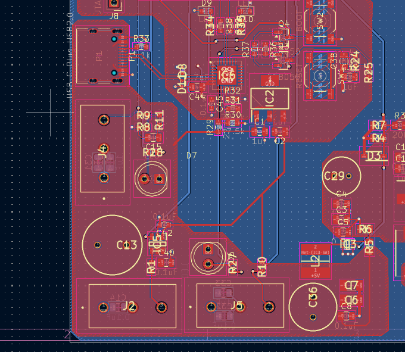

_**Figure 6: The initial traces for the first round PCB that I worked on**_

## February 24th, 2026

#### The objective of this session was complete the E-shop order form for our PCB.

I added all the resistors we can find in the eshop to the E-shop order form to submit to Manvi. A lot of our resistors are only available on Digikey so I am trying to set them up in a Digikey order. I went through in Digikey and identified all the resistors we need and added them to a cart that is shared with Anjali. Everything we are using is surface mount as it is easier to solder them on. 

## February 27th, 2026

#### The objective of this session was to complete the design document for submission.

Today I worked on the design document. I completed the parts list on the design document as well as the schedule. I also ended up adding to the ethics section and looking over requirements and verifications. I then went on to find parts to order on Digikey for all of the ICs, Fuses, and other parts such as the Buck Convertor and connectors and added them to the Digikey cart. I know we need to have multiples of our components for our various PCB rounds, but I think that will be difficult as we have already hit our budget with just the required amount of components. I spoke to my team about it and we have decided that we will just remove those parts from our PCB and re-solder them to new PCB iterations as needed. We will order more parts if those parts burn. This is the best way for us to stay within our budget and avoid spending too much of our own money. I think we reached the budget limit because our project has a lot of sensors, which cost the majority of our funds. Finally, I placed the Digikey order. Now, we are just waiting for all our parts to come in so that when the PCB arrives we can begin soldering.

## March 1st, 2026

#### The objective of today's meeting was to prepare for our Design Review.

Today we met as a group to plann out what to do this week. We split up parts of the design document for each of us to present during our Design Review this Tuesday. We also discussed the breadboard demo and what we will have to do for that. We verified that all our surface mount parts are ordered for our PCB, and we plan to ask our TA about which subsystem we can build for our breadboard demo. We are currently planning on building our servo motor subsystem (the fish feeder subsystem). Anjali and I will be primarily working on the breadboard while Estela makes updates to our PCB design. Estela has said that there are some areas of the first round PCB that she wishes to change. Specifically, some resistor values were types incorrectly in our schematic, so that is something she is going to work on while Anjali and I work on the breadboard.

## March 3rd, 2026

#### The objective of today's meeting was to complete our Design Review.

Today, we presented our design ideas to Professor Kim in our Design Review. This was a good experience as we practiced our presentation a lot. I was tasked with explaining our power subsystem and various aspects of our physical design, as well as how our water quality subsystem would work. Professor Kim asked us if we would be using real fish in our project but we explained that would not be safe for the fish and thus we do not intend to do that as it would violate ethics. Other than that, Professor Kim did not have feedback for our group. Our TA said that our circuit schematics looked strong and that we were in good shape. She also told us that our parts had been delivered. We decided to begin working on our breadboard demo since we now have the servo motor we need to try out our fish feeder subsystem. 

## March 5th, 2026

#### The objective of today's meeting was to work on the fish feeder subsystem for our breadboard demo.

Today, we worked on the fishfeeder subsystem of our breadboard demo. First, Anjali and I began writing the code for the fish feeder. Since the fish feeder would just use a servo motor, this was quite simple. I had previously written embedded servo motor code in my robotics team freshman year of college, so I knew that we could just make the feeder rotate 180 degrees to dispense food from its shaft, and then halt the motor for a few milliseconds so that food can come out, and then rotate the fish feeder back. We verified that this code would work by referencing the arduiono library for servo motor control. After that, Estela came by and set up the circuit schematic on our breadboard for the fish feeder subsystem using various in-hole versions of our surface mount components. I have attached an image of this circuit below. We debugged the code and were able to get the fish feeder working.

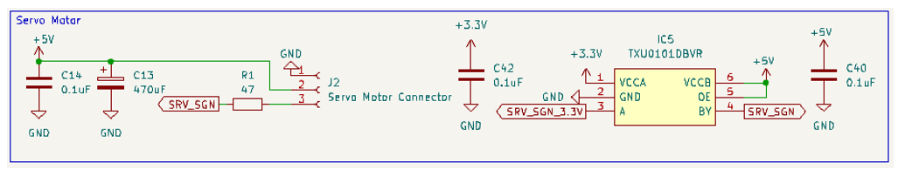

_**Figure 7: The schematic for the fish feeder subsystem that we replicated on a breadboard**_

Sources:

https://docs.arduino.cc/learn/electronics/servo-motors/

https://docs.arduino.cc/tutorials/generic/basic-servo-control/

## March 8th, 2026

#### The objective of today's meeting was to continue working on our breadboard demo.

Today, we continued working on our breadboard to get it ready for the breadboard demo. Since we already had the fish feeder subsystem working, we decided to setup the flow meter, pH sensor, and temperature sensors as well. The benefit of the breadboard demo is that we can test that our circuit schematics work, so we wanted to make use of this opportunity to test as much of our circuit as we could. If we got all these sensors working we would have our fish feeder subsystem and our water quality subsystem tested on the breadboard. Estela once again hooked the sensors up to the breadboard following our PCB schematic (but using through-hole components rather than surface mount). Anjali and I worked on the code to integrate using the servo motor for the fish feeder alongside the temperature sensor, pH sensor, and flow sensor. We started with the pH sensor. 

For the PH sensor code, we heavily referenced the documentation for the pH sensor we ordered from DFRobot. The pH must be polled frequently since dangerously acidic or basic water can kill fish quickly. Reading individual voltage samples would produce high variance in voltage readings, so instead we maintained a circular buffer of the last 40 ADC readings, overwriting the oldest value once full. This allowed us to sample accurately and get a good average pH reading. 

To get the voltage that correlates to a pH we used the equation __voltage = averageArray(pHArray, arrayLength) * 3.3/4096__. This equation was adapted from the RFRobot datasheet which has the equation __voltage = averagearray(pHarray, ArrayLength)*5.0/1024__. Our adaptation basically accounts for the fact that the voltage readings from the sensor are in an odd format. Since the voltage is in an analog read from the PH pin and the ESP32 has a 12 bit Analog-to-Digital converter, the voltage reading is scaled to a value between 0 to 4095 instead of a true voltage reading (since there are 12 bits in the value and 2^12 = 4096). So, to account for taht, we need to multiply the average reading voltage in the ADC value by the microcontroller's analog reference voltage, which is 3.3 volts. Then, we need to divide by the maximum ADC value, which is 4096. Thus, the final voltage is the true voltage and is scaled as needed.

After that, we need to calculate the pH associated with the specific voltage we have. To do this, we used pHValue = 3.5*voltage + offset. The 3.5 factor here is from the pH sensor's documentation, as it is the slope of the line in the graph of voltage reading versus the associated pH created by the manufacturers of the sensor. We figured out the offset ourselves based on our callibration of the pH meter. The pH meter came with truly neutral solution so we knew it had to be a pH of 7 reading when powered. But, the reading was around 4.81. Thus, we knew we needed an offset of 2.19.

However, we were running into issues as when the servo motor would run, the pH sensor would stop working. We realized that the issue had to be that electrical noise was causing issues for our pH sensor. Since all of our sensors are on one microcontroller, components are not isolated enough and thus they are getting affected by noise. To fix this, we decided to have the servo motor rotate every 60 seconds, but have the pH sensor every 50ms. Thus, the overlap between the two would be limitted. This timing trick allows us to minimize interference between the two pieces of code. 

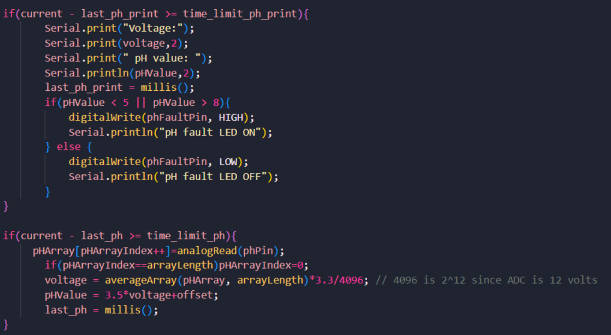

_**Figure 8: The code for our pH sensor which polls every 30ms**_

After working on the pH sensor code, we began working on the water flow meter code. To do this, we referenced documentation which said that we could use interrupts to trigger the flow rate measurement. Basically, the flow meter would increment the flow rate every time it detected a rising edge of a signal pulse. We used this implementation but as we werer testing with print statements and blowing into the sensor, we realized that the a flow rate would get measured, but that the pH reading would be off and the servo motor would not rotate. I debugged this issue for a while using various print statements, and then I realized the issue was that because we were using interrupts for this sensor, we were running into a race condition where the program would stop the servo motor rotation or pH reading in order to measure the flow rate when we blew into the flow meter (triggering the interrupt) and then that would mess up the timing dependency of the two other sensors as we polled them for specific intervals of time. This was a major moment in the code development of this project.

I tried to fix this by implementing locking so that we would pass the lock to whichever sensor was going to run but this was an issue becuse we kept getting the same result. 

We decided we would switch to polling the flow sensor and we made it so that when the if the servo motor was not on and a falling edge was detected in the digital read we would increment a value called NbTopsFan, which counts the amount of pulses we detect in the digital read between the last flow meter reading and the present time. Then, only if it has been 5 seconds since our last flow meter reading, we conver that pulse rate to a liters per hour flow rate and print it out to the serial port. The equation we used for this conversion is based on the original documentation, which is __l_hour = (flow_frequency * 60/7.5)__. Our equation based on our code ended up being __flowRate = (NbTopsFan * 60.0 / 7.5)__. We basically scale up the pulse rate to what it would be in a minute and then divide by the calibration factor of the sensor which is 7.5. When we tested this out, our flow meter was able to output a reading when we blew into it and did not cause issues with out pH output or servo motor rotation. 

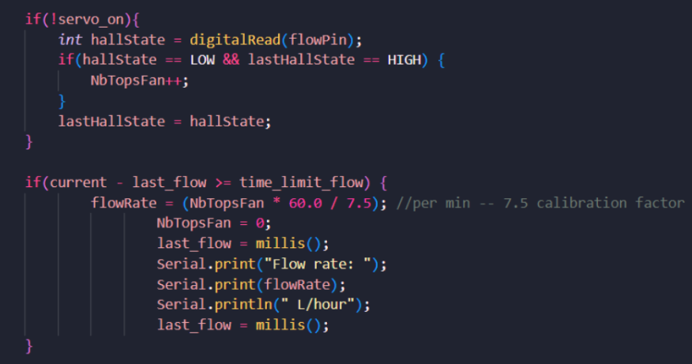

_**Figure 9: The code for our flow meter sensor**_

Finally, we tried to write the code for our temperature sensor to complete the water quality subsystem, but this was a problem because no matter how we hooked the sensor up to our circuit, it was indicating that it was not working. We followed the setup specified in the documentation for the temperature sensor and its datasheet, which involved using the OneWire and DallasTemperature libraries. Since the sensor uses the 1-Wire Protocol, it only needs a single data wire to communicate with our ESP32. OneWire basically handles this protocol and abstracts it out so we do not have to directly implement it, and DallasTemperature makes it so that the temperature can just be requested and read easily without complicated math like the pH sensor had. Thanks to these libraries, we just had to call the getTempCByIndex() built in function to find the current temperature reading. However, since the sensor was printing that it had "no connection" we tried to debug the circuit but found that there were no issues with it. We decided that the temperature sensor itself was probably broken and thus ordered a new one.

Sources:

pH sensor docs:

https://www.dfrobot.com/product-1782.html?srsltid=AfmBOoo5I5f6A2DubIK4bCnJrU6rIzth6ot6NB8PFI30DAoV3T-d4wld

flow meter interrupt code docs: 
https://www.seeedstudio.com/blog/2020/05/11/how-to-use-water-flow-sensor-with-arduino/

flow meter docs:
https://www.digikey.com/en/products/detail/seeed-technology-co-ltd/314150005/5488047

temperature sensor docs (digikey, onewire, dallastemp):
https://www.adafruit.com/product/381?gad_source=1&gad_campaignid=23438252138&gbraid=0AAAAADx9JvQ3qmjjw72X7CmfS2hvWiGjp&gclid=CjwKCAjwzevPBhBaEiwAplAxvk8uHv18sLie9gfX7gl94rW6yfcyy-tJAf6tQtmNwKZ77QcHz5-YWxoCTmgQAvD_BwE

https://www.adafruit.com/product/381?gad_source=1&gad_campaignid=23438252138&gbraid=0AAAAADx9JvQ3qmjjw72X7CmfS2hvWiGjp&gclid=CjwKCAjwzevPBhBaEiwAplAxvk8uHv18sLie9gfX7gl94rW6yfcyy-tJAf6tQtmNwKZ77QcHz5-YWxoCTmgQAvD_BwE

https://docs.arduino.cc/libraries/dallastemperature/

## March 9th, 2026

#### The objective of this session was to do our breadboard demo.

Today was our breadboard demo. We demoed how our fish feeder, pH sensor, and water flow sensor were working. Professor Kim said we made good progress and had no additional feedback. Our TA told us that we did a good job and we were very happy with these results. Additionally, I felt confident knowing that most of the code (other than the grow lights, fault LEDs, and water pump code) was working. We decided that in the coming weeks we would continue to work on the code and Estela would work on updating the PCB board again for the third round order.

## March 12th, 2026

#### The objective of this session was to place the third round PCB order.

For the third round PCB design, we all looked over the footprints and I readjusted the parts order to add in some new resistors we needed and order extras of them just in case.I also reviewed the schematic to make sure there were no glaring issues and we submitted the PCB order to Manvi. We also dropped off our sensors (temeprature, pH, flow sensor) as well as the water pump to the machine shop so they could build around it for our final model.

## March 23rd, 2026

#### The objective of this session was to meet with the machine shop to check on our design and to work on soldering our PCB.

Following Spring Break, we now had our third round PCB design physically with us (along with the first two rounds). We first met with the machine shop and spoke with them about our project. We had given them our sensors to build around and they told us we could have them back so we could begin working on our PCBs. We began soldering our surface mount parts onto the PCB.

## March 26th, 2026:

#### The objective of this session was to continue soldering and to submit our fourth round PCB order. 

Today, we continued soldering the PCB and also worked on submitting our fourth round PCB order. We could not find any major things to change from our third round to the fourth round, as the primary issue was that we had just received our third round order (and the first PCB we physically had) and didn't have time to test it before the fourth round order. This was very frustrating, but we understood that the course could not control how late all the PCB orders had arrived. Thus, we decided that we might have to order our own PCB by ourselves if that is allowed, if this third round PCB has any major issues.

## March 28th, 2026:

#### The objective of today's session was to work on the LED driver code for our grow light subsystem, as well as writing the code for the fault LEDs.

I was tasked with writing all the code for the LED driver subsystem. I wanted to simulate morning, night, sunrise, and sunset with the grow lights on the grow light PCB to help the plants grow best. In order to do this, I knew that I had to adjust the brightness of the LEDs by sending a different percent of the duty cycle of the PWM signal that is sent from the microcontroller to the LED driver. I read up on how arduino handles LED driver PWM cycles and decided to use the LEDC (LED Control) library for arduino esp32. I decided to first set up an led channel with a PWM frequency of about 5000 Hz. Then, I checked the current time to see if it fell within various intervals to decide if the LEDs should be in sunrise state, sunset state, morning, or night. Since the ledc functions use a resolution of 8 bits, I knew the PWM signal could range from 0 to 255. However, the ESP32 only accepts a maximum of 3.3 Volts, so I did not want to create an unsafe situation by sending in too large of a signal. I decided to use only about 30% to 60% of the full duty cycle for testing to ensure our PCB would not get fried. I set the maxmimum PWM to be 155 (70% of 255) and the minimum to be 75 (30% of 255). Thus, I was able to write the code for night time (the minimum) and day (the maximum). 

For the sunrise and sunset states, I came up with linear functions to control the LED brightness based on what point within the sunrise or sunset intervals we are in. For sunrise, I created the equation __intensity = (current - startLedSeq)\*(pwmMax - pwmMin)/sunrise__. I made this by considering that we needed to scale the current time within the sunrise interval to the corresponding PWM value between the minimum and maximum duty cycle that we were sending out. Thus, we find out how long it has been since the sunrise sequence began and scale it accordingly. This allows the sunrise state to have the LEDs gradually brighten to maximum day brightness over time.

The sunset equation is __intensity = -1*((timeSunset)*(pwmMax - pwmMin)/sunset) + pwmMax)__. I came up with this to scale the time point we are in within the sunet interval to a PWM value between maximum and minimum, starting at the maximum and heading towards the minimum (hence the negative slope). 

Finally, I decided to add the fault LED code in with digitalWrites of HIGH signals when the desired sensor readings were out of bounds. For temperature, this was if the temperature was outside of 78 to 80 degrees farenheit. For pH, this was if the pH was outside of 6 to 8. For the flow meter, this was if the flow rate was less than 3 times the volume of the tank. Since the tank is 0.8 gallons, this was a minimum rate of 9.085 liters per hour.

I have attached an image of my grow LED code below.

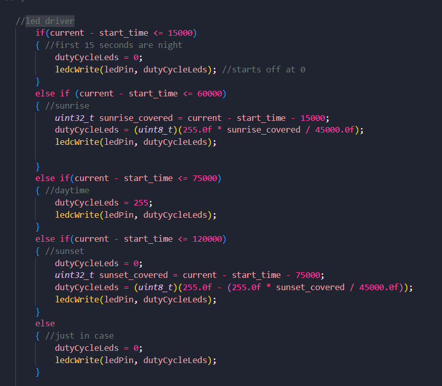

_**Figure 10: The code for our grow LEDs and LED driver**_

Sources:

https://docs.espressif.com/projects/arduino-esp32/en/latest/api/ledc.html

## April 1st, 2026:

#### The objective of today's session was to test out my LED driver code, as well as the rest of the code on our soldered third round PCB. 

We used the same code for our pH and flow sensors, and our fish feeder, as from our breadboard demo. We found that all of the sensors were working well with the PCB (we ran the same tests as we did with the breadboard demo, where we tested the pH sensor with the purely neutral solution and serially printed out the pH reading, blew into the flow sensor and serially printed out its reading, and visually confirmed that the servo motor was rotating every minute). However, the grow LEDs were not lighting up. I was worried there was an issue with my code, so I had Anjali review it, but we confirmed that it did not have any major bugs. Estela used a multimeter to probe the LED driver and found that it was not getting the right voltage readings. This meant there was something wrong with the LED driver circuit. Estela emailed Manvi to discuss it as she looked over the schematic and could not figure out what was going wrong with the design. 

While testing out the Fault LEDs, I saw that none of the LEDs were lighting up despite the pH and flow rate being out of range. I used a multimeter over the LEDs and discovered that they were not receiving any signal when they should have received a signal HIGH to turn on. I looked over the microcontroller documentation and confirmed the issue. Basically, these two fault LEDs had been hooked up to input-only pins on the microcontroller, rather than I/O pins. Thus, they were not able to actually receive the required signal HIGH to turn on. In order to fix this for this third round PCB, Estela used bodge wires to correct the wiring. The Fault LEDs then worked and turned on when the pH and flow rate were out of range. We discussed that we would fix this wiring for the fourth round PCB order.

## April 2nd, 2026:

#### The objective of today's session was to complete and 3D print the fish feeder shaft to go on the servo motor for our fish feeder.

Today, I worked on 3D printing our fish feeder. I had the basic CAD estela created, but I needed to get measurements based on our servo motor size. Using Estela's caliper, I took measurements of the shaft the servo motor (and thus the fish feeder) would connect to and adjusted the CAD model accordingly. I then 3D printed it (it was only a 23-minute print). The physical model had no way of going onto the servo motor, as it was just a cylinder with holes for food. I knew to fix this I had to design a lid system. I spent the day creating a new CAD model which would have a press-fit lid that would attach to the servo motor shaft, so that the cannister could be removed and reattached (to fill with food). I 3D printed this out and it was a good final design for our project. I have attached an image of the old and new designs below.

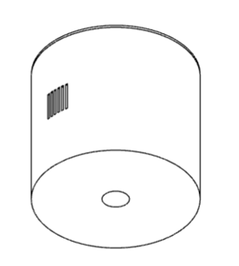

_**Figure 11: The old fish feeder CAD model**_

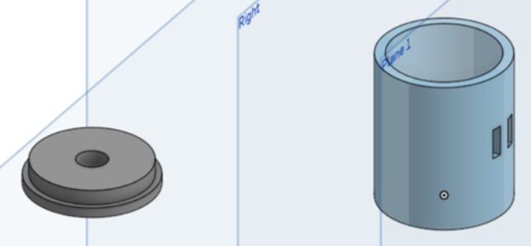

_**Figure 12: My new fish feeder cad model with a press-fit lid**_

## April 6th, 2026:

#### The objective of today's session was to do our Progress Demo.

We picked up our physical model from the machine shop today, so we now have our water pump back and I can write its code soon. Today, we completed our progress demo. Our TA said our project was in good shape and she was glad that everything but the LED driver was working. She said she was still thinking about ways we could address our LED driver issue (which Estela is continuing to work on). I said that once our new temperature sensor comes in we would add it to our PCB with the code we already have, and that I would begin writing the water pump code soon. 

## April 8th, 2026:

#### The objective of today's session was to write the water pump code and test it out with our physical apparatus.

Today, I wrote the water pump code. For the water pump, we want to be able to adjust its speed based on the flow rate measured by the flow sensor. If the flow is below 9.085 liters per hour, we want the fault LED to turn on and for the water pump to speed up so that the flow goes above that threshold. To write this code, I once again referenced the LEDC library for arduino ESP32. Although the flow pump isn't an LED, this library can still be used as it is just meant to control writes of PWM cycles. I decided that within the block of code where the flow meter was read, I would check if the flow rate was less than 9.085 liters per hour. If it was, then I would send about 70% of the duty cycle (a maximum of 255) to the water pump, which was around 178 Volts. After I completed the code, I decided to test it with the PCB and the physical apparatus. I filled the water tank with water as the water pump requires it and ran my code on the PCB. Immediately, a part of the PCB began smoking so I disconnected it from power. I was worried about our PCB but I used a multimeter to make sure that nothing was shorted. I spoke with my team and we decided to work on debugging the PCB over the weekend.

Sources:

https://docs.espressif.com/projects/arduino-esp32/en/latest/api/ledc.html

## April 12th, 2026

#### The objective of today's session was to assess damage to our board, fix whatever was wrong with it that caused it to smoke, and test the water pump code.

Today we took a look at the PCB again to figure out why it was smoking when I tested the water pump code. Estela used a multimeter to check various parts of the board and again confirmed that nothing had been shorted. She looked over the schematic and the PCB design and realized that the footprint that she used for the LDO on the board (a default footprint) was actually in the wrong orientation so the sink and source were flipped. Thus, the part started smoking when we finally had a part that required a full 12 Volts of power (which was the water pump). So, we used bodge wires to fix this issue and have the correct parts of the component connect to the circuit in the right orientation. After that, we began testing my water pump code again. We started with 5% of the duty cycle to turn on the pump and wanted to see if we could gradually up the percentage of the duty cycle sent to the pump within the code until we found a percent that would result in a flow rate above the minimum requirement. This way, we would be able to avoid sending too large of a duty cycle into the pump. When doing this, I found that a value of 25 (10% of the maximum duty cycle) got us to a flow rate well above the minimum (roughly 20 liters per hour), and I decided to keep that number as the signal to send into the water pump if the flow rate is too low. I also tested that when the flow rate was below the minimum, the flow rate Fault LED lit up, which it did. I knew that for our final and progress demo we would have to show our requirement which was that the flow rate would be below the minimum and the Fault LED would turn on (in real life, this would happen if fish feces clogged the pump, but here nothing obstructs the pump so the flow really just stays relatively steady at whatever we set the pump flow rate to). To do this, I came up with the idea to send 0% of the duty cycle to the water pump in the first 30 secconds of powering the PCB in order to demonstrate this behavior, and then after that use my normal code to maintain the appropriate flow rate. I have added a picture of this code below. 

Alongside this, we hooked up our new temperature sensor to our PCB board and it worked with no issues, indicating the issue was not our code but rather that our first sensor was faulty.

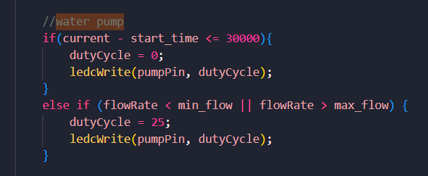

_**Figure 13: The portion of the water pump code for our demo where the water pump will not turn on for the first 30 seconds**_

## April 14th, 2026:

#### The objective of today's session was to replace our LED driver part with a new part so that we could test the LED Driver Code.

Today was an eventful day in terms of our project. Since we had everything working except our grow lights, we decidede to replace our old LED Driver chip with a new LED driver part, the LDH-25-W. The benefit of using this LED driver is that it is a singular driver that can be connected to our board with a connector we have on it, rather than soldered to the board. We added this new LED driver in and the grow lights began to work, which was very exciting. 

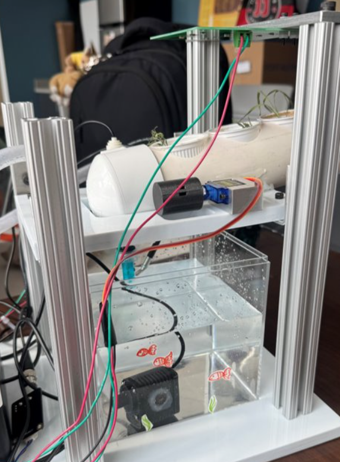

_**Figure 14: Our full apparatus**_

However, an issue we ran into is that while we were testing our code, the USB programmer was plugged in incorrectly as 3 volts was connected to the ground pin, thus this shorted out that connector part of our board. We removed the chip associated with the USB programmer from our board and had to replace our microcontroller as well as it got damaged from the heat of the resoldering in that area of the board. Luckily, we had an extra microcontroller or this would have been very bad. We tested all of our code again and were glad to see that all of it worked correctly. We began prepping for our mock demo and mock presentation. 

## April 20th, 2026:

#### The objective of today's session was to complete our mock demo.

We demoed our project to our TA. We received feedback that the wires had to be neater in our project to make it look more cohesive and not like a prototype. Also, our TA told us to minimize the amount of serial prints we had and clean up the output to make it easy to read. This was important as we currently have all our Fault LED tests running (print statements saying the LED should be on) as well as all pH readings, a print that the servo motor is on, prints of what state the grow lights are in, a print of the temperature, and a print of the flow rate. We began working on our mock presentation slides. 

## April 22nd, 2026:

#### The objective of today's session was to prepare for our mock presentation. 

Today, we finished up our slides for the mock presentation and practiced timing ourselves to make sure we did not go over the 15 minute requirement. 

## April 23rd, 2026:

#### The objective of today's session was to complete our mock presentation.

Today, we completed our mock presentation. Our feedback was that our slides with our physical apparatus should have arrows and labels indicating what each part is, and more photographs overall. Our TA said that our overall presentation was good. Once this was done we decided to work on our final demo preparations (figuring out how we would show all of our verifications for our requirements).

## April 26th, 2026:

#### Today's objective was to be fully prepared for our final demo.

Today, Anjali and I worked on final setup for our final demo. We began testing everything for our design and verification requirements. For the water flow sensor, we realized we needed to verify that the flow meter was accurate. To do this, I came up with the idea that we should use a cup to check that the time it took to fill the cup using the water pump in the appartus, scaled up to a rate of liters per hour, would indicate if the flow rate was accurate or not. We conducted this experiment and verified that our flow meter was accurate. We recorded a video clip of this to show during our demo and also to add to our final video. On top of this, we verified our temperature sensor's accuracy using a food thermometer. For our pH sensor, I bought alkaline water (which has a pH of greater than 9) so that we could dip the pH sensor into that and verify the pH change from tap water in the tank (which has a pH around 7). This would also allow us to show how our fault LEDs would turn on for the unsafe alkine water as it has a pH outside of the desired range of 6 to 8. However, we noticed that the pH readings were slightly off (too small) for our liquids. We verified the pH of the liquids using pH strips, so we knew there was something wrong with the pH sensor. We realized that the water pump's frequency was interfering with the sampling frequency of the pH sensor, as the two were too similar. Initially, both of them had a frequency of around 5000 Hz. To address this, we decreased the water pump's frequency to 1000 Hz. This solved the issue as there was no more drift in the pH value and the pH value was accurate for both the tap water and the alkaline water. 

## April 27th, 2026:

#### The objective of today's session was to finish having our verifications complete for our final demo.

Estela joined us and we worked on completing these. We took video clips of using the multimeter on various parts of the PCB board to confirm that the components on the board were receiving the required voltage amounts, thus verifying our requirements for our power subsystem. With all of our requirements met, we worked on creating the verifications and requirements table to print out and give to our professor and peer reviewers during our final demo tomorrow. 

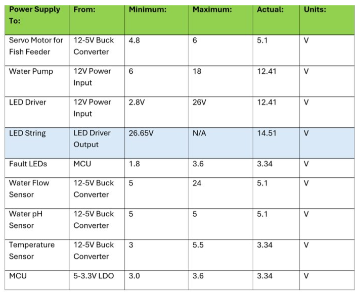

_**Figure 15: Table of the power subsystem verifications**_

## April 28th, 2026:

#### The objective of today's session was to complete our final demo.

Today we completed our final demo. We were able to successfully demonstrate all of our requirements and verifications and were very happy with our demo. Our feedback from our professor was that we did a good job. We were very happy with our work.

## April 30th, 2026:

#### The objective of today's session was to complete our final presentation preparation.

Today we completed our slides for the final presentation and finished our video as well. We also practiced our presentation and timed ourselves to make sure we would remain within the 15 minute limit for our presentation.

## May 1st, 2026:

#### The objective of today's session was to complete our final presentation.

Today we completed our final presentation. Our professor told us we did a good job. We were very happy with all of our work this semester. We received a notification from our TA that our project had received an Honorary Mention for the final projects showcase. This was a very fulfilling semester and I am very happy with our project, Circle of Life: Automated Desktop Aquaponics System. I learned so much about PCB design, got so much hands-on embedded software development experience, and really learned what it means to create a full product from start to finish. I am so grateful for my team and our TA and our professor.

