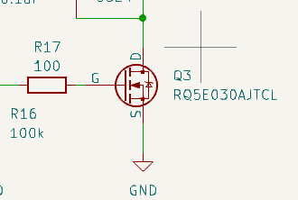
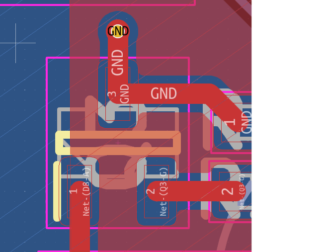
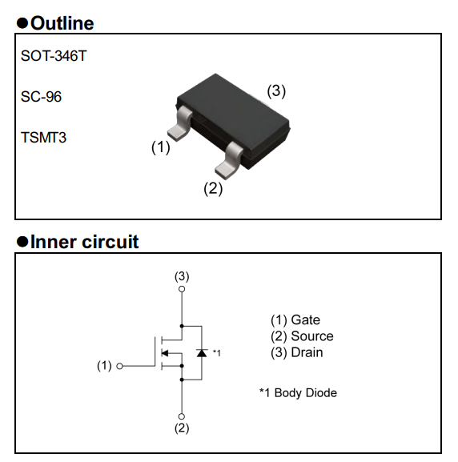

# ECE 445 Lab Notebook
###### By Estela Medrano

---

# Date: April 14, 2026

## Objective

Bodge wire fault LEDs from V2.

---

Aishwarya said something burned. After doing a quick connectivity test, we saw 3.3V was shorting with GND. Aishwarya said the top right part was smoking. Desoldered LDO. 3.3V stopped shorting with GND. Replaced LDO.

Why did the LDO break when the pump ran? Check the schematic.

Found issue -> Water Pump NMOS symbol does not match footprint. 

Fixed by rotating it.

Works well now!
