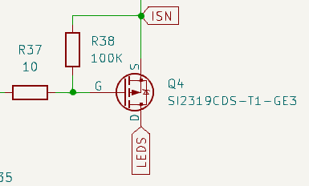
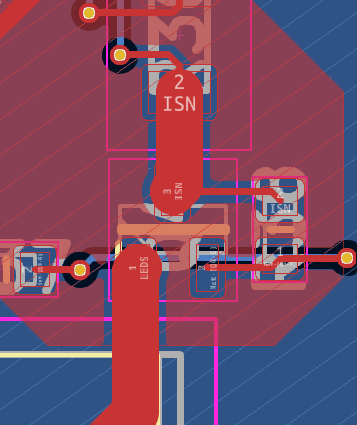
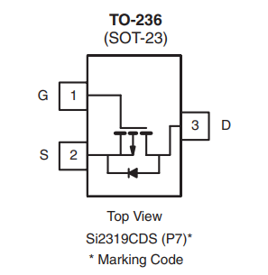
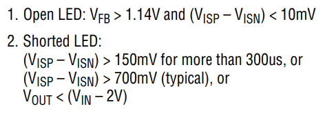

# ECE 445 Lab Notebook
###### By Estela Medrano

---

# Date: April 25, 2026

## Objective

Re-test the original LED driver.

---

Last attempt to fix LED Driver! Replaced IC with a secondary IC, probed all pinouts and found the following:

Changed UVLO & OVLO to be the same exact values as in the datasheet.

We found out the FAULT pin was being driven low, and from there I realized that based on the datasheet that it meant open circuit.

Add picture from datasheet about FAULT conditions.

From there, I looked at the PMOS in the schematic and the layout, and saw something weird. I compared it to the datasheet, and realized that the main problem is that I had it flipped incorrectly.

Once fixed, we heard it switching but it broke again. From here, we probed all pins and found out that the internal regulator (INTVCC) was no longer outputting anything, not allowing the IC to soft-start again because SS depends on the internal regulator. Since the internal regulator was broken, we no longer had ICs, and there was no more time to order a new one, so we decided to fully switch to our backup solution.

Table with pinouts probed after IC stopped switching and tests made:

| Area Checked | What I Tested / Measured | Result | Conclusion |
|---|---|---|---|
| UVLO Network (initial) | Changed to 1.1M, 59k and 100k for first test | EN/UVLO = 1.285 V | Too close to enable threshold, should modify |
| UVLO Network (changed) | Changed to Top = 1M, Middle = 365k, Bottom = 59K | EN/UVLO = 2.0 V, OVLO = 0.8 V | UVLO/OVLO conditions are better now |
| PWM Startup Test | Set PWM HIGH from ESP32 | Heard switching briefly, then stopped | Converter attempted startup, then faulted/shut down |
| FB Voltage | Measured VFB | 0.45 V | Converter not reaching regulation or OV threshold |
| FAULT Pin | Measured FAULT | LOW | LT3922 actively detecting a fault condition |
| Open-LED Fault Check | Compared VFB to open-fault threshold | VFB below 1.14 V threshold | Open-LED fault unlikely |
| INTVCC Rail | Measured INTVCC | 0 V | Internal gate-driver rail not operating |
| SS Rail | Measured SS | 0V | Soft start never started, or shutdown |

## Resources of the day

- https://www.analog.com/en/products/lt3922.html

