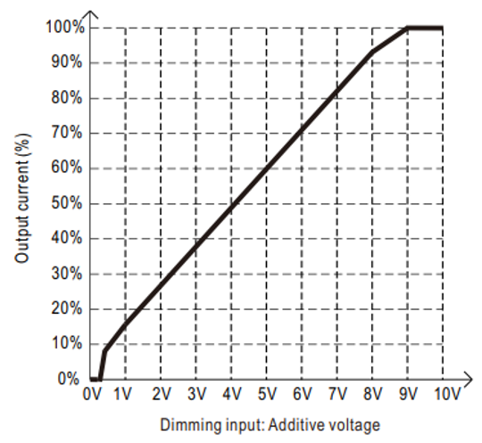

# ECE 445 Lab Notebook
###### By Estela Medrano

---

# Date: April 5, 2026

## Objective

Figure out a replacement LED driver.

---

After asking Manvi to review our LED Driver schematic, she could not find any errors. We don’t really know what the issue is at this point. During the demo, we talked to the professor about it. He said it's ok if we replace the LED driver, we just have to properly explain why it failed and how the replacement works during the demo.

What about MP3362?

- 3.0V to 36V Input Voltage Range
- 4A Peak Current Limit
- Analog/PWM Dimming
- LED Short/Open, UVLP, OVP, FB Short Protection
- Is really simple to wire

I can’t order a new PCB though.

I found a good backup: LDH-25-250W.

Why is it good? ->

- Constant-current LED driver
- 12.5-85V
- Output current is 250mA
- LEDs are rated around 200–300mA, so 250mA is still in range though a little bit too high. It was the lowest of the options from this brand.
- Can still use 12V input
- Supports dimming
- 
- Works well for ESP32, it also caps the current to 40%, so we are not overdriving the LEDs. 0.40×250mA=100mA
- Has SCP and OVP built in

## Resources of the day

- https://www.digikey.com/en/products/detail/mean-well-usa-inc/LDH-25-250W/12759945
- https://www.monolithicpower.com/en/mp3362.html?srsltid=AfmBOoqPEkdyaVfDVTrpOqtySqk_39cHLrCYkBQ-Q-6jopqi5il-1uuz

