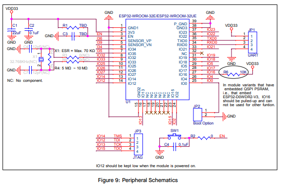

# ECE 445 Lab Notebook
###### By Estela Medrano

---

# Date: February 21, 2026

## Objective

Add USB-to-UART circuit, MCU and finish schematic.

---

## USB Programmer

Adding USB-to-UART to make programming the ESP32 easier. Originally I was thinking of just using BOOT and RESET buttons plus jumper wires on UART, but having both options is probably better. This way, I can still manually program/debug if needed, but normal programming can happen through USB-C.

CP2102C-A01-GQFN28: https://www.silabs.com/interface/usb-bridges/classic/device.cp2108?tab=specs&s_kwcid=AL%2116736%213%21771477203756%21b%21%21g%21%21wifi+module&gad_source=1&gad_campaignid=22182774628&gbraid=0AAAAAD_h18k8AaXG0qu8BAjCw4D0cEw2k&gclid=CjwKCAjwzevPBhBaEiwAplAxvog57aMnN_8sBb0lR-JNGo36PV1jX51ORhgVtquic-rTV9Qe_zRtiRoCb-EQAvD_BwE

Using this as the USB-to-UART bridge. I saw a similar setup in the ESP32 DevKitC V4 schematic, except that board uses Micro-USB instead of USB-C. Since programming the MCU is pretty important, I wanted to copy a known working setup instead of making up this whole section from scratch.

For USB-C, the CC pin needs a pull-down resistor so the upstream port knows this board is a device/sink. The design doc mentions using a 5.1kΩ resistor to ground on CC. This tells the USB-C source that the board wants power.

The USB D+ and D− lines go from the USB-C connector to the CP2102C.Need to keep these routed carefully because they are differential USB data lines. For this project, since the distance is short, it should be okay.

Added ESD protection diodes on the USB lines to protect the board from static discharge when plugging/unplugging the USB cable.

The DevKitC V4 schematic uses an auto-reset and boot circuit so the computer can automatically put the ESP32 into programming mode. I copied this idea using the USB-to-UART control lines.

DTR and RTS drive two transistors that control IO0 / BOOT & MCU_EN / RESET

BJT circuit for BOOT and EN using USB-UART programmer:

- DTR = 0, RTS = 1 → IO0 is pulled down
- DTR = 1, RTS = 0 → MCU_EN is pulled down
- DTR = 0, RTS = 0 → MCU_EN is pulled high elsewhere, IO0 is pulled high internally
- DTR = 1, RTS = 1 → IO0 is pulled high, MCU_EN is pulled high

This circuit should make uploading code way less annoying. Without it, I would need to manually hold BOOT, press RESET, release RESET, and then release BOOT at the right time.

Still keeping the physical BOOT and RESET buttons is useful because if auto-programming does not work, I can still force the ESP32 into bootloader mode manually.

I also added LEDs that turn on during programming/TX/RX activity. Mostly for debugging. If upload fails, seeing whether the TX/RX LEDs blink can help tell whether the CP2102C is actually sending data or if the issue is somewhere else. Will these interfere with the data line?

Added UART pins in case this circuit doesn’t work so that we can use an external USB-to-UART bridge. Added JTAG too in case we want to debug that way. Both can be seen in the datasheet example.

## Resources of the day

- https://www.solder.party/docs/usb-c-cp2102/downloads/
- https://randomnerdtutorials.com/esp32-pinout-reference-gpios/
- https://dl.espressif.com/dl/schematics/esp32_devkitc_v4-sch.pdf
