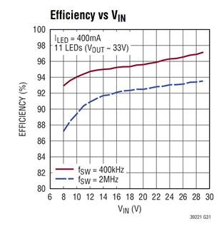
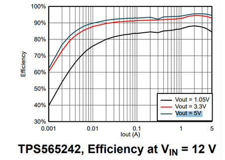

# ECE 445 Lab Notebook
###### By Estela Medrano

---

# Date: February 25, 2026

## Objective

Make sure power requirements are met.

---

Must operate reliably for the selected AC-DC adapter, which is 12V, 6A (72W).

## 3.3V Loads

Temperature sensor: Takes max 1000nA for current. Utilizes 3.3V supply.

`P=3.3(1000nA)=3.3uW`

ESP32: High peak current: 0.5A

`Power=0.5A×3.3V=1.65W`

LDO: The power dissipation can be calculated as: `(VIN−VOUT)×Load Current`

Since the main load current is the ESP32, our approximate dissipated power is:

`(5−3.3V)×0.5A=0.85W`

Total 3.3V Load: `1.65W+0.85W=2.5W`

## 5V Loads

SG90 Servo: Stall current: 650 ± 80mA. Worst case: 0.73A

`Worst case power=5V×0.73A=3.65W`

Water flow sensor: Max current: 15mA

`Max power=5V×0.015A=0.075`

pH sensor: No power information, but takes in 5V and using a similar example, it should take between 5-10mA.

`Max power=5V×10mA=0.05W`

Accounting for the 2.5W load coming from the LDO and its corresponding loads, we get:

`The total load power=3.65W+0.075W+0.05W+2.5W=6.275W`

## 12V Loads

Water Pump: Maximum input current: 0.5A

`Maximum power=12V×0.5A=6W`

## LEDs and LED Driver

Deep Red: `Number of LEDs×Max LED current×VF Red = 5×0.3A×3.7V=5.55W`

Royal Blue:`Number of LEDs×Max LED current×VF Blue = 5×0.3A×2.7V=4.05W`

Total power by LEDs: 9.6W

Overhead power: `VIN quiescent current×12V=12V×4mA=48mW`

Efficiency for VIN = 12V and switching frequency of 2MHz, we get around 91%.

For the 500mOhm shunt resistor measuring the current through the LEDs, we can calculate the power it dissipates using `P=I^2R=(0.3)2(0.5)=0.045W`

Total power consumed:

`PIN=9.6/Efficiency+Overhead Power= (9.6W+0.045W)/(0.91)+48mW=10.64W`

Lastly, we consider the load from the 5V calculated and its load of 6.275W. We can calculate the efficiency according to the graph [PICTURE], in which the efficiency should be around 95%. Thus, the total power consumed by this is: `(6.275)/(0.95)=6.6W`

`6.6W+10.64W+6W=22.64W`

This is perfect since our power supply is rated for up to 72W. We might be able to add WIFI & Bluetooth.

## Resources of the day

- https://toshiba.semicon-storage.com/us/semiconductor/knowledge/e-learning/basics-of-low-dropout-ldo-regulators/chap4/chap4-2.html
- https://forum.digikey.com/t/what-is-quiescent-current-and-why-is-it-important/3894

