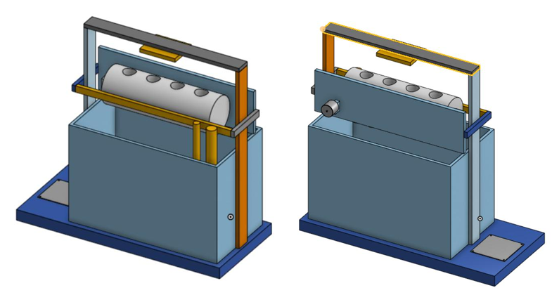
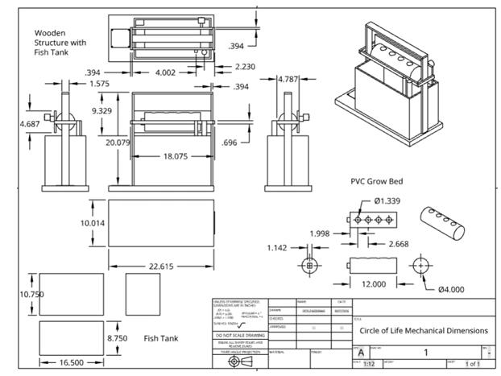
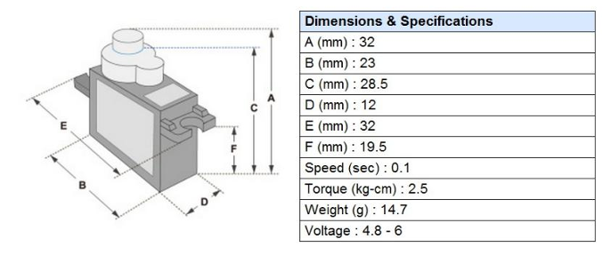
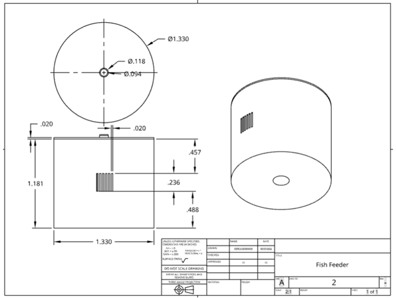

# ECE 445 Lab Notebook
###### By Estela Medrano

---

# Date: February 26, 2026

## Objective

Make a preliminary 3D CAD design of the physical requirements in order to show it to the machine shop.

---

Started physical design by setting the fish tank size first since everything else needs to fit around it.

## Fish tank dimensions

- Length: 16.500 in
- Depth: 8.750 in
- Height: 10.750 in

I need to build a wooden frame around this without making the whole system too bulky. Current full base/structure length looks around 22.615 in, so still compact enough for desktop scale.

For the grow bed, using 4 in PVC pipe. This should work for NFT-style flow and is simple to mount with pipe clamps.

## PVC grow bed notes

- PVC pipe diameter: 4.000 in
- PVC pipe length: 12.000 in
- Net cup hole diameter: about 1.339 in
- Planning around 4 plant holes
- Hole spacing shown around 1.998 in / 2.668 in depending on center positions
- Pipe clamp / support spacing needs to match the wooden rack
- Need to keep PVC slightly above the fish tank rim so water can flow back down into the tank. The current drawing has the grow bed sitting above the tank with the wooden structure holding it. Also need a slight slope for water return, around 2%.

## Wooden frame notes

- Frame needs to hold PVC pipe, LED board, and fish feeder
- Main front structure height shown around 20.079 in
- Side support height shown around 4.687 in in one view
- Upper support/spacing has measurements like 4.002 in, 2.230 in, and 0.394 in that I should keep in mind when modeling the top rack
- Base length shown around 22.615 in
- Need space for tank, tubing, pump wire, and sensor wires

The water pump should sit inside the tank, probably in one corner, using suction cups. Tubing should go from pump to PVC inlet. The flow sensor can go near the PVC/tubing section so it checks if water is actually reaching the grow bed.

## Sensor mounting

- pH and temperature sensors need to be held so enough of the probe stays underwater
- Probably use a small wooden plank/bracket attached to the frame
- Need to avoid placing sensors where fish feeder or pump tubing gets in the way

The fish feeder needs to mount near the back/top of the tank so food can drop into the water.

## SG90 servo dimensions

- A: 32 mm
- B: 23 mm
- C: 28.5 mm
- D: 12 mm
- E: 32 mm
- F: 19.5 mm
- Voltage: 4.8V to 6V
- Torque: 2.5 kg-cm
- Weight: 14.7 g

## Servo motor hole measurements to use for fish feeder

- Big hole outer: 6.9mm
- Big hole inner: 4.85mm
- Small hole outer: 4.65mm
- Small hole inner: 2.55mm

## Fish feeder coupler / container notes

- Outer diameter: 1.330 in
- Height: 1.181 in
- Center hole diameter: 0.118 in
- Smaller center dimension: 0.094 in
- Slit/opening height area shown around 0.236 in
- Slit position roughly between 0.488 in from bottom and 0.457 in from top
- Small top spacing shown around 0.020 in
- Need slit big enough for betta pellets, around 0.5 mm to 1.5 mm
- Need center hole to fit onto SG90 shaft/coupler

## PCB placement notes

- Main PCB stays near base/control area
- LED PCB mounts above grow bed facing down
- Need leave holes/openings for barrel jack, USB-C, and terminal blocks
- Need enclosure around main PCB for protection
- LED enclosure should stay open on LED side so light can shine down

## Things still not final

- Exact fish feeder mounting position
- Exact tubing path
- Sensor bracket placement
- Exact PCB enclosure placement
- Whether any dimensions need to change after testing fit with real parts

Use this for CAD.

Results:

- 

- 

- 

- 

## Resources of the day

- http://www.ee.ic.ac.uk/pcheung/teaching/DE1_EE/stores/sg90_datasheet.pdf
- https://www.petsmart.com/fish/tanks-aquariums-and-nets/aquariums/aqueon-standard-glass-rectangle-aquarium-5345486.html?redirected=true
- https://Www.amazon.com/CoscosX-Plastic-Hydroponic-PlantingBaskets/Dp/B071H51DRZ?Th=1
- mullettools.com/products/4-inch-thin-wall-furniture-grade-pvc-pipe-lightgray?srsltid=AfmBOooB2E2_wTROrZeA-FXmLRjT-pVKQeHeAogrwLPC86nX5K8ByoA05ec
- https://www.aqueon.com/resources/care-guides/betta
- https://lgpress.clemson.edu/publication/introduction-to-aquaponics/
- https://unric.org/en/aquaponics-ancient-wisdom-for-new-food-production/

