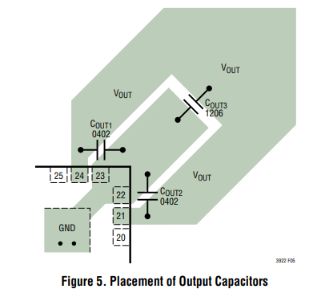
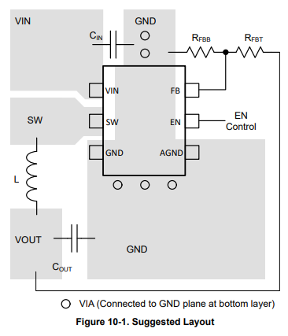

# ECE 445 Lab Notebook
###### By Estela Medrano

---

# Date: March 4, 2026

## Objective

Finish layout for the second round.

---

Couple of notes from today’s session:

- 3.3V -> Top Right, Right, and Top.
- 5.5V -> Top left, left. A buck converter can be placed in the middle. Find a way to route it from left to right for the LDO.
- 12V -> Bottom.
- LED Driver -> Bottom right corner.
- Signals routed through the GND plane.
- Keep C2102 and USB connection as short as possible.
- Use the differential routing option in KiCAD for D+ and D-.

Keep these in mind again:
- 
- 
